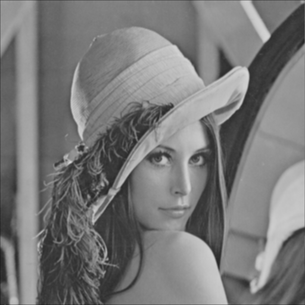
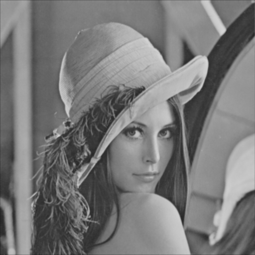
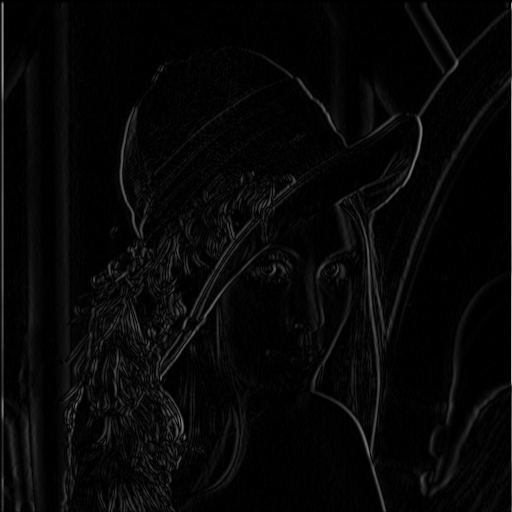
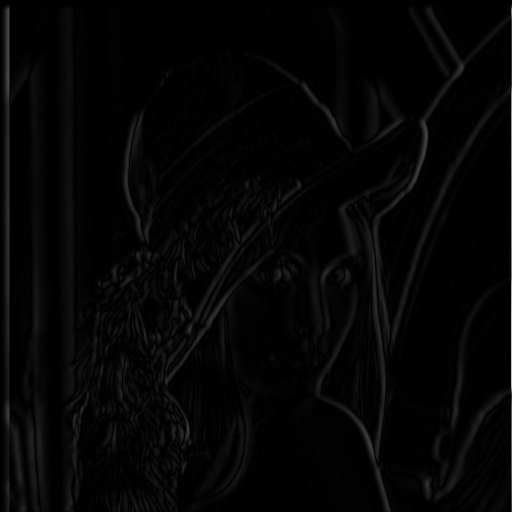
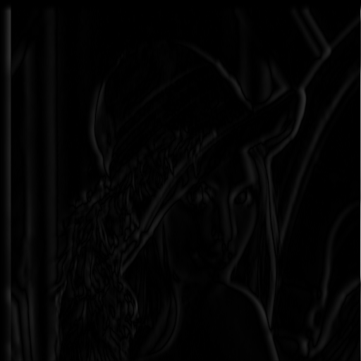

# Compte Rendu TP3 P4y

## Convolution

La convolution consiste à calculer la valeur de chaque pixel à l'aide d'un masque donnée. 
Le masque est centrée sur le pixel, la valeur du pixel au centre est égal à la somme des produits de chaque pixel voisin par la valeur du masque au coordonnée de ce même pixel (le pixel voisin).


Le masque sera une image de type double.

La première chose à faire est de parcourir chaque pixel de l'image de départ avec une double
boucle. Ensuite il s'agit de parcourir les pixels voisins au pixel courant. Le masque étant aussi
une image on peut procéder à l'aide d'une double boucle.

```
for(int my = 0; my<mask.getDy(); my++)
      {
        for(int mx = 0; mx<mask.getDx(); mx++)
        {
          if( ((x-(mask.getDx()/2)+mx)<0) || ((y-(mask.getDy()/2)+my)<0) || 
		((x-(mask.getDx()/2)+mx)>img.getDx()) || ((y-(mask.getDy()/2)+my)>img.getDy()) )
          {
            sum += 0;
          }else
          {
              sum += mask(mx,my)*img(x+mx-(mask.getDx()/2),y+my-(mask.getDy()/2));
          }
        }
      }
```
Il faut aussi faire attention aux valeurs en dehors de l'image ,en effet lorsque l'on parcours
le masque il se peut que l'on se situe en dehors de l'image la condition suivante permet de faire
attention aux cas ou l'on sort de l'image (gauche/droite/haut/bas), ce qui nous fais un total de 4 conditions.

```
if( ((x-(mask.getDx()/2)+mx)<0) || ((y-(mask.getDy()/2)+my)<0) || 
((x-(mask.getDx()/2)+mx)>img.getDx()) || ((y-(mask.getDy()/2)+my)>img.getDy()) )

```

Si l'on se situe dans l'image on peut alors calculer la valeur du pixel voisin et l'ajouter à la somme.
Pour cela on multiplie le pixel voisin par le coefficient du masque en mx my.

``` 
sum += mask(mx,my)*img(x+mx-(mask.getDx()/2),y+my-(mask.getDy()/2));
```

Il faut faire attention à bien calculer la position du pixel voisin.

Lissage M1 :


Lissage M2 :



##Masque gaussien

On nous donne la fonction gaussienne et on nous savons que nous devons approcher le support par un masque de taille $`N\times N`$ avec $`N\approx 6\sigma`$, impair. Il faudra ensuite normaliser les coefficients pour que la somme des des poids du masque soit égale à 1, on décompose donc le tout en plusieurs opérations.
Premièrement on approche $`N\approx 6\sigma`$, en faisant bien attention à ce que $`sigma`$ soit impair,
on peut ensuite déclarer le masque de taille $`N\times N`$.

```
if( int(6*sigma)%2==0) // cas pair
  {
    N = int(6*sigma)+1;
  }
  else
  {
    N = 6*sigma;
  }

  double sum=0;

  Image<double> res(N,N); // masque
```

Ensuite on parcours le masque en appliquant la fonction gausienne pour chaque pixel,on passe par une fonction intermédiaire appelé gaussF. On réalise la somme des poids des coefficients (il ne faut pas oublier de normaliser) :

```
for(int y=0; y<N; y++)
  {
    for(int x=0; x<N; x++)
    {
      res(x,y)=gaussF(x,y,sigma);
      sum += res(x,y);
    }
  }
```


La fonction gaussF :

```
double gaussF(int x,int y, double sigma)
{
  double res = 0;
  res=exp(-(pow(x,2)+pow(y,2))/(2*pow(sigma,2)));
  return res;
}
```

Il ne reste plus qu'à normaliser : 
```
for(int y=0; y<N; y++)
  {
    for(int x=0; x<N; x++)
    {
      res(x,y)=(res(x,y)/sum);
    }
  }
```

Il ne faut pas oublier de convertir les images résultant de la convolution qui sont de type double
en image de type uint_8, il suffit de faire une fonction de conversion :

```
Image<uint8_t> toUint8(Image<double> &img)
{
  Image<uint8_t> res(img.getDx(),img.getDy());
  for(int y = 0; y0)
      {
        weightSum += mask(mx,my);
      }
    }
  }
```

Ensuite comme pour la convolution on vérifie que l'on ne sort pas de l'image à l'aide de conditions :
```
if( ((x-(mask.getDx()/2)+mx)<0) || ((y-(mask.getDy()/2)+my)<0) || ((x-(mask.getDx()/2)+mx)>img.getDx()) || ((y-(mask.getDy()/2)+my)>img.getDy()) )
          {
            sum += 0;
          }else
          {
              sum += mask(mx,my)*img(x+mx-(mask.getDx()/2),y+my-(mask.getDy()/2));
          }
```

Une fois la somme calculé on calcule la valeur absolue de la somme et on la normalise par la somme des poids positifs précédemment calculé :
```
if(sum<0)
      {
        sum = (-sum)/weightSum;
      }else{
        sum = sum/weightSum;
      }
      res(x,y)=sum;
```
Voici les résultats avec le filtre détecteurs d'arêtes pour des image avec le masque gaussien appliqué pour plusieurs valeurs :

$`sigma=1`$ 


$`sigma=3`$


$`sigma=5`$


