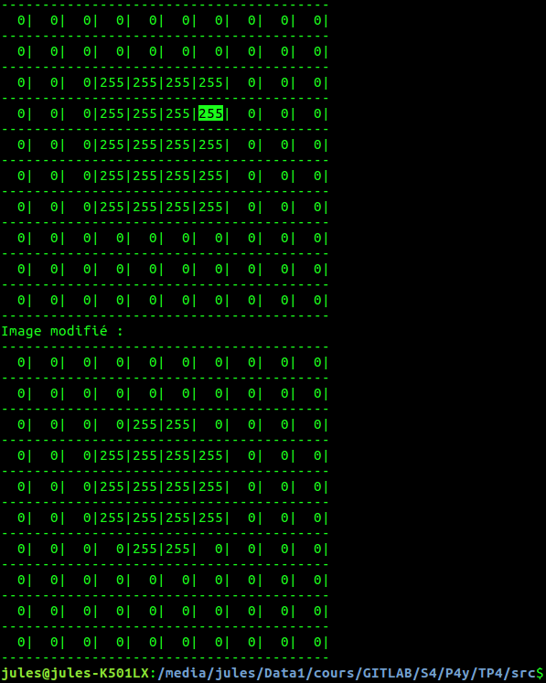
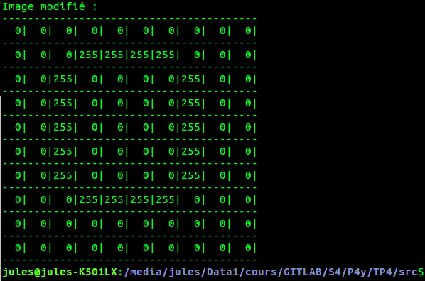
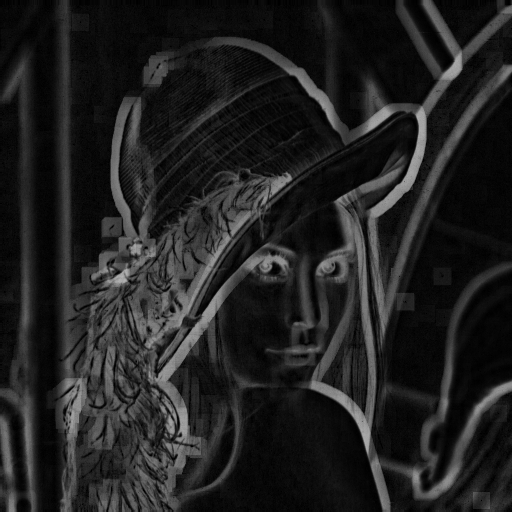
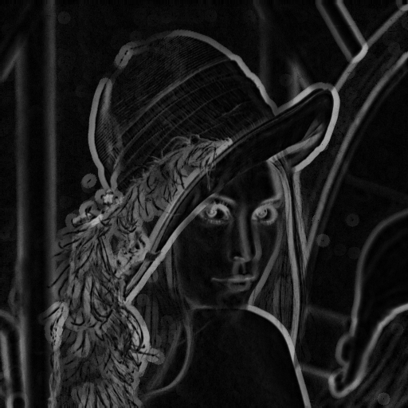
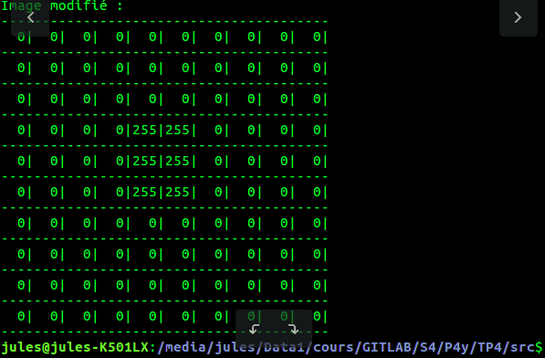
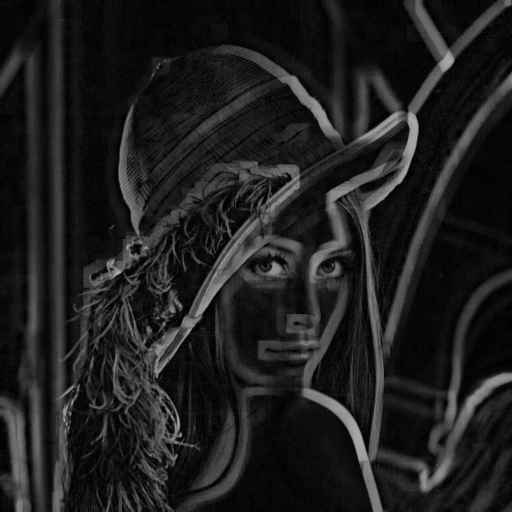
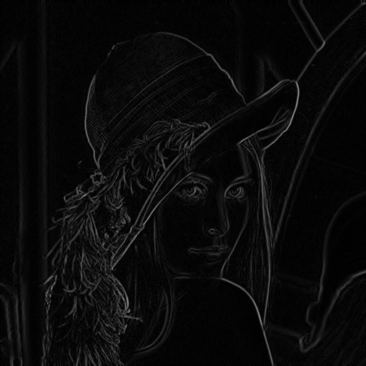
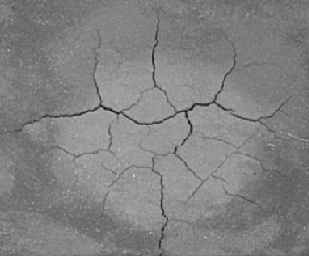

# Compte rendu TP4

## Filtre médian

Le principe du filtre médian est de remplacer le pixel au centre du filtre
par la médiane de tout les pixels contenus dans le filtre. Ce procédé permet 
d'améliorer la qualité d'image dégradées. La taille de la fenêtre sera
de taille $`sigma\times sigma`$ avec $`sigma`$ impair pour que le pixel qui va être modifié
puisse être au centre du filtre. On va lister les pixels dans une liste puis trier la 
liste avant de choisir la médiane. La valeur médiane permet de choisir une valeur de pixel 
qui s'accorde bien avec les pixels voisins, la liste étant triée par ordre croissant. Si l'on veux
reconstituer une image on va toujours essayer de prendre des valeurs moyennes.

### Implantation

L'implantation n'est pas très compliqué, nous avons déja implanté et utilisé de nombreux filtres.
Ce qui était un peu plus compliqué était la gestion de la taille du tableau qui varie en fonction
du cas ou l'on se situe (bords haut droit/gauche ... ,bords, "centre"). Car cette fois ci on ne peut
pas remplacer les pixels en dehors de l'image par des 0 car cela fausserait le calcul de la médiane.
On choisit d'utiliser des vector dans ce cas (structure de données). Les vector agissent à la fois comme une pile et comme une liste.
La taille est dynamique et l'on peut "pousser" des objets dans un vector, nous n'avons alors pas à nous 
soucier de la taille. Une fonction de tri est déja implanté pour les vector et il est possible d'accéder à
un objet stocké dans une liste grace à son index ce qui nous permet de trouver facilement la médiane.

```c++
  if( ((x-(N/2)+nx)<0) || ((y-(N/2)+ny)<0) || ((x-(N/2)+nx)>=img.getDx()) || ((y-(N/2)+ny)>=img.getDy()) )
            { // dans ce cas le pixel est en dehors de l'image on ne fait rien

            }else{
              list.push_back(img(x+nx-(N/2), y+ny-(N/2))); // on pousse la valeur du pixel parcouru dans la liste
            }
          }
        }
        std::sort (list.begin(), list.end()); // tri croissant
        res(x,y)=list.at((list.size()/2)-1); // médiane
        list.clear();
```

## Classe Structel

Pour pouvoir définir une classe représentant un élément structurant nous avons besoin d'un
objet ayant une liste de points définis par des coordonnées. La classe structel aura donc en attributs
un vector de **points**. Les points seront représentés par une structure nommé **Couple** qui a pour
attributs 2 entier x et y.

```c++
struct Couple
{
    int x;
    int y;
};

class Structel
{


private:
  std::vector<Couple> points;

public:
  //Construit un élément structurant avec une liste de points
  Structel(std::vector<Couple> &p);
  // construit un élément structurant carré de coté N
  static Structel carre(int n);

  static Structel disque(int r);

};

```

Je me suis inspiré de la convolution pour implanter la méthode statique qui
retourne un élément structurant carré. On peut utiliser la même méthode pour 
parcourir les pixels voisins pour construire le carré.

```c++
Structel Structel::carre(int n)
{
  if(n>0)
  {
    std::vector<Couple> points;
    int y;
    int x;
    for(y=0; y<2*n+1; y++)
    {
      for(x=0; x<2*n+1; x++)
      {
        struct Couple point;
        point.x=x-((2*n+1)/2);
        point.y=y-((2*n+1)/2);
        points.push_back(point);
        std::cout<<point.x<<point.y;
        printf("\n");
      }
    }
  }
  return Structel(points);
}
```

Vérification pour un carré n = 2:


On vérifie le résultat en affichant le carré au fur et à mesure de sa construction.

Pour construire le disque de rayon r rien de très compliqué. L'équation de disque
euclidien de rayon r nous est donnée. Il suffit de parcourir un carré de coté R et
de vérifier pour chaque point si il se situe dans le disque. Les points du carré qui
n'appartiennent pas au disque seront éléminés lors de leur passage dans la condition.

```c++
  for(y=-r; y<=r; y++)
      {
        for(x=-r; x<=r; x++)
        {
          if( (pow(x,2)+pow(y,2)) <= pow(r,2) ) // est ce que le point (x,y) est dans le cercle si oui alors
          {
            struct Couple point;
            point.x=x;
            point.y=y;
            points.push_back(point); // on l'ajoute à la liste des points du disque 
            std::cout<<point.x<<point.y; // on vérifie
            printf("\n");
          }
        }
      }
```

Vérification pour un disque R = 2:


## Méthodes d'érosion et de dilatation

On implante les méthodes d'érosion et de dilatation qui seront des méthodes d'instance
de la classe Structel. 

```c++
  Image<uint8_t> opening(Image<uint8_t> &img);
  Image<uint8_t> closure(Image<uint8_t> &img);
```

Comme décrit dans le sujet de TP on parcours tous les points
(x-i, y-j) pour la dilatation et (x+i, x+j) pour l'érosion
ou (x,y) un point de l'image et (i,j) un point de 
l'élément structurant. Pour la dilatation on cherche le minimum
dans l'ensemble des points parcourus alors que pour l'érosion on
cherche le maximum.

```c++
Image<uint8_t> Structel::dilate(Image<uint8_t> &img)
{
  std::vector<Couple> points = this->points; // on passe par un tableau intermediaire
  Image<uint8_t> res(img.getDx(), img.getDy());
  for(int y=0; y=0) && ((x-points[pt].x)>=0) )//bords de l'image
            {
              if( img(x-points[pt].x, y-points[pt].y)>max)
              {
                max = img(x-points[pt].x, y-points[pt].y);
              }
            }
        }
        res(x,y) = max;
    }
  }
  return res;
}
```

Pour chaque pixel de l'image on cherche le maximum
dans l'ensemble des points (x-i, y-j) avec (x,y)
le point de l'image et (i,j) le point de l'élément
structurant. A chaque itération (dans la boucle qui
parcours les points de l'élément structurant) on 
compare le point avec le max, il faut faire 
attention à ne pas compter les points au bord de l'image.

On fait la même chose avec l'érosion sauf que cette fois
ci on fait (x+i, y+j).

```c++
Image<uint8_t> Structel::erode(Image<uint8_t> &img)
{
  std::vector<Couple> points = this->points; // on passe par un tableau intermediaire

  Image<uint8_t> res(img.getDx(), img.getDy());
  for(int y=0; y=0) && ((x+points[pt].x)>=0) )//bords de l'image
          {
            if( img(x+points[pt].x, y+points[pt].y)<min)
            {
              min = img(x+points[pt].x, y+points[pt].y);
            }
          }
        }
        res(x,y) = min;
    }
  }
  return res;
}
```

### Tests érosion dilatation

#### Érosion

On test en premier lieu l'érosion sur une image de synthèse avec un élément structurant disque (r=1 => croix), on constate que l'implémentation de l'opérateur est correcte : 


Les valeurs aux bords de l'image sont bien abaissées au minimum (ici 0).

On vérifie le résultat de l'érosion pour les 2 éléments structurants
disque et carré. On fait aussi varier la taille des éléments.


##### Application 

Type d'élément|  2 |  4 |  8 | 
|---|---|---|---|---|
**Carré** |   |   |   |
**Disque** |   |   |   | 

On voit bien que la taille des zones érodées sont proportionnelles à la taille 
de l'élément structurant et que leurs forme dépendent de l'élement.

#### Dilatation


On test la dilatation sur une image de synthèse avec le même élément structurant en forme de croix (disque r=1), on constate que la dilatation fonctionne correctement :

 

Les points aux bords de l'image ( à l'exception des coins du au fait que l'élément structurant est une croix) ont désormais une valeur de 255 (la valeur max).


##### Application
 
Type d'élément|  2 |  4 |  8 | 
|---|---|---|---|---|
**Carré** |   |   |   |
**Disque** |   |   |   |

Encore une fois on remarque que la taille des zones dilatées sont
proportionnelles à la taille de l'élément. On arrive clairement à
distinguer la forme de l'élement structurant entre les 2 images
dilatées de taille d'élément 8.

### Ouverture et fermeture

Rien de très compliqué pour l'ouverture et la fermeture. IL suffit 
dans un cas d'éroder l'image puis de la dilater et vice-versa dans 
l'autre cas.

```c++
Image<uint8_t> Structel::opening(Image<uint8_t> &img)
{
  Image<uint8_t> res(img.getDx(), img.getDy());
  res = this->erode(img);
  res = this->dilate(res);
  return res;
}

Image<uint8_t> Structel::closure(Image<uint8_t> &img)
{
  Image<uint8_t> res(img.getDx(), img.getDy());
  res = this->dilate(img);
  res = this->erode(res);
  return res;
}
```

#### Tests ouverture

On test l'ouverture avec une image de synthèse et le même élément structurant en forme de croix (disque avec r=1) :



L'ouverture à l'effet escompté. On remarque que la valeurs des coins de l'image est abaissé au minimum.


##### Application
 
Type d'élément|  2 |  4 |  8 | 
|---|---|---|---|---|
**Carré** |   |   |   |
**Disque** |   |   |   


#### Tests fermeture

Pareil pour la fermeture, on test avec le même élément structurant que pour les autres test :


L'image ne change pas et cela est normale, quand on regarde la dilatation par ce même élément structurant 
on se rend compte que l'érosion aura juste pour effet de faire revenir l'image dilatée à l'image d'origine :


##### Application 

Type d'élément|  2 |  4 |  8 | 
|---|---|---|---|---|
**Carré** |   |   |   |
**Disque** |   |   |   


### Gradient interne, externe et morphologique

Le gradient externe consiste à soustraire la dilatation de l'image par
l'image d'origine. Le gradient interne consiste à soustraire l'image d'origine
par l'image érodée. Ensuite le gradient morphologique est le résultat de la différence 
entre l'image dilatée et l'image érodée.


#### Tests gradient externe

On réalise de nouveau le test sur l'image de synthèse pour valider l'implémentation de l'opérateur :

image dilatée| - | image d'origine | = | gradient externe| 
|---|---|---|---|---|
 | |  | |  |


##### Application 

Type d'élément|  2 |  4 |  8 | 
|---|---|---|---|---|
**Carré** |   |   |   |
**Disque** |   |   |   


#### Tests gradient interne

On vérifie aussi l'implémentation du gradient interne : 

Image d'origine | - | image érodée | = | gradient interne | 
|---|---|---|---|---|
 | - |  | =  |  |


##### Application 

Type d'élément|  2 |  4 |  8 | 
|---|---|---|---|---|
**Carré** |   |   |   |
**Disque** |   |   |   


#### Tests gradient morphologique


Gradient mophologique avec élément structurant carre de coté 3 


Gradient morphologique avec élément structurant croix 


#### Transformée en tout-ou-rien par l'élément structurant composite (A,B)


### Applications

#### Filtrage morphologique 

Les disques étant blanc, une dilatation semble être le bon opérateur. Un élément structurant à peine
plus grand que les structures noires permettrait d'éclaircir ses mêmes structures. Les disques serait 
néamoins un peu agrandis. L'élément structurant ne doit pas être un carré ou alors les disques blanc
auront une formé carré après l'opéaration. La dilatation ne changera pas la couleur des disques car ils 
ont déja la couleur max, néanmoins les structures étant plus sombres, la dilatation va éclaircir les structures à l'aide de l'élément structurant (c'est pour cela que l'élément structurant doit être plus grand que les structures sinon la valeur max sera la couleur des structures et elles ne changeront pas de
"couleur").

|Original|Résultat|
|---|---|
 |  |

#### Restauration

Ici on cherche à enlever les rayures noires (tout en essayant de conserver l'image d'origine). La dilatation semble encore l'opérateur le plus approprié. Les rayures étant noire, la dilatation permettra
avec l'élément structurant approprié (donc plus large que les rayures) de trouver une valeur max qui permettra d'éclaircir les rayures. Il faut un élément assez grand sinon la valeur max sera le niveau de gris de la rayure.

|Original|Résultat|
|---|---|
 |  |

#### Fissures 

Un peu plus compliqué cette fois ci. Pour faire apparaître les fissures on 
utilise l'opérateur de gradient morphologique. On utilise un élément structurant
de type disque et de taille 1 pour essayer de garder la taille des fissures 
aussi grande que la taille originale.
Cet opérateur agit en 3 temps : 

* L'image d'origine va être dilatée, les zones claires vont restées claire pas de changement
majeurs à ce niveau la. Par contre les bords des fissures (ou l'ensemble des fissures
 si l'élément structurant est assez grand) vont êtres éclaircis. En effet les bords des fissures étant noires, lors de la dilatation la valeur max sera celle de la terre claire au voisinage. 

* L'image d'origine va être érodée. Les zones ou la terre est claire ne seront pas modifiées
car il n'y à pas de points sombres aux alentours de ses zones. Les points claires adjacent aux 
fissures noires seront assombris. 

* On soustrait le dilatée par l'érodée. A ce moment les zones claires sans voisinages sombres deviendront 
noires car les points ont la même valeur après les opérations d'érosion et de dilatation. Les bords des fissures qui s'étaient éclaircies resteront clairs car ses même bords s'étaient assombris lors de l'érosion, résultat cela permet de mettre en avant les fissures.

| Original | Résultat |
|---|---|
 |  |

#### Granulométrie


