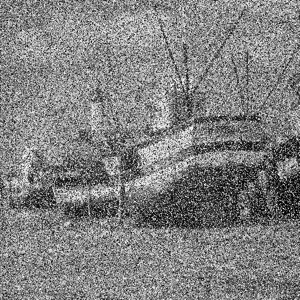
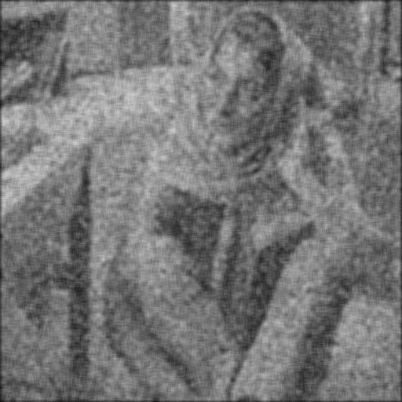

# Compte rendu TP5 Jules Van Assche

## Bruit synthétique

### Bruit impulsionnel

La première chose à faire est de génerer un nombre aléatoire compris entre 0 et 1 pour le comparer
à la probabilité passé en paramètre. On utilise rand() pour génerer un nombre aléatoire et on le
ramène entre 0 et 100 avec le modulo pour le diviser par 100 et obtenir un float compris entre 0 et 1.
Génération du nombre entre 0 et 1 :

```c++
if ( (rand()%100)/100.0 < p )
```

Lorsqu'un pixel sera altérée on va décider aléatoirement avec une probabilité de 50%
de sa valeur (0 ou 255)

```c++
if(rand()%2==0)
{
   res(x,y) = 0;
}else{
   res(x,y) = 255;
}
```

Ce qui nous donne au final :

```c++
if ( (rand()%100)/100.0 < p )
{
  if(rand()%2==0)
  {
    res(x,y) = 0;
  }else{
    res(x,y) = 255;
  }
}
else
{
  res(x,y) = img(x,y);
}
```

On teste avec une image de synthèse avec pour probabilité 0.4 et 0.8 :

```
proba :0.4--------------------
  1 |  2  |  3  |255  |  0  |
--------------------
  6 |  7  |  0  |  0  | 10  |
--------------------
 11 |  0  |  0  | 255  | 15 |
--------------------
 16 |  0  |  0  | 255 | 255 |
--------------------
  0 | 22  | 23  | 24  | 25  |
--------------------
```

```
proba :0.8--------------------
255 | 255 | 255 |  0  |  0  |
--------------------
255 | 255 | 255 |  0  |  0  |
--------------------
  0 | 12  | 255 | 14  |  0  |
--------------------
  0 | 255 |  0  | 19  | 20  |
--------------------
  0 |  0  | 255  |  255 |  0  |
--------------------
```

On regarde maintenant le résultat pour des vraies images :

Probabilité |  0.1 |  0.4 |  0.8 |
|---|---|---|---|---|
|Images |   |  |  |

### Bruit gaussien

On veut désormais implémenter le bruit gaussien. Il faudra pour cela nous aider de
la classe normal_distribution qui s'ocuppe de la répartion des valeurs pour une moyenne
et un écart type données.
Le protoype de la classe ressemble à ça ;

```c++
Image<uint8_t> noiseGaussian(Image<uint8_t> &img,float avg,float deviation);
```

On va parcourir l'image d'origine puis pour chaque pixel ,nous allons lui attribuer une
nouvelle valeur qui sera sa valeur d'origine + la valeur génerée par la fonction gausienne.
Il faut faire attention à bien ramener la nouvelle valeur à zéro si elle est inférieure à 0,
et ramener la valeur à 255 si elle est supérieure à 255.

```c++
std::default_random_engine generator(time(NULL));
std::normal_distribution<float> distribution(avg, deviation);
```

Après avoir initialisé la distribution on va pouvoir attribuer leur nouvelles valeurs
à chaque pixel.

```c++
if(val<0)
{
  val = 0;
}else if(val>255)
{
    val = 255;
}
```

Ensuite il suffit de récuperer la valeur de la distribution de l'ajouter à la valeur
du pixel courant puis de ramener la valeur si elle est en dehors de l'ensemble.

```c++
for(int y=0; y255)
    {
        val = 255;
    }

    res(x,y) = (uint8_t) val;
  }
}
```

#### Validation et résultats

On test la fonction sur une image de synthèse :

Gaus | Originale |  m = 10 $`\sigma=1`$ |
|---|---|---|---|---|
|Images |   |  |

On voit bien qu'on ajoute en moyenne 10 avec une variance de 2.


Gaus | Originale |  m = 30 $`\sigma=15`$ | m = 60 $`\sigma=30`$ | m = 120 $`\sigma=60`$ |
|---|---|---|---|---|
| Images |   |  |  |  |


### Mean Square Error

On veut pouvoir mesurer la différence moyenne entre une image
bruitée et une image non bruitée. On va donc faire la somme de la difference élevée au carré pour chaque pixel de l'image bruitée et chaque pixel de l'image original. On divisera ensuite cette somme par le nombre de pixels dans une des 2 images (peu importe laquelle elles ont le même nombre de pixels).
On va donc utiliser une double boucle pour pouvoir accedéder chaque pixel des 2 images. Ensuite il suffit de réaliser la différence entre le pixel de l'image bruitée et de l'image originale et d'élever au carré :

```c++
for(int x=0; x<imgN.getDx(); x++)
{
  for(int y=0; y<imgN.getDy(); y++)
  {
    sum  += (imgO(x,y)-imgN(x,y)) * (imgO(x,y)-imgN(x,y));
  }
}
```

Puis finalement on divise cette somme par le nombre de pixels des images qui à été préalablement initialisé.

```c++
int NM = imgN.getDx() * imgN.getDx();
...
...
res = sum/NM;
return res;
```

### Validation

On va tester la fonction sur une image de synthèse avec un bruit impulsionnel (p=0.1), on essaye d'avoir une seule valeur à 255 histoire de pouvoir facilement calculer le MSE à la main et comparer avec ce que la fonction renvoie.


Nous avons qu'une seule valeur qui est différente entre l'image d'origine et l'image bruitée, ce qui veut dire qu'hormis pour cette valeur toutes les différences entre les autres points donneront 0 et ne compteront pas pour le MSE. On réalise juste la différence pour le point différent, on élève cette différence au carré et on divise par le nombre de pixels (ici 25). ((255-1)^2)/25 = 2580
On retombe sur la valeur renvoyé par la fonction.

### Tests

**On obtient les résultats suivant pour le bruitage gaussien :**

Bruit gaussien | m = 0  et $`\sigma=15`$ | m = 0 et $`\sigma=30`$ |
|---|---|---|---|---|
**Visuel** |   |   |
**MSE** | 224 | 870 |

Bruit impulsionnel | p = 0.15 | p = 0.40 |
|---|---|---|---|---|
**Visuel** |   |   |
**MSE** | 2983 | 7650 |

On utilise désormais des filtres pour essayer de réduire le bruit :

**Avec le filtre moyenneur de taille 3 :**

Bruit gaussien + filtre moyenneur 3 | m = 0  et $`\sigma=15`$ | m = 0 et $`\sigma=30`$ |
|---|---|---|---|---|
**Visuel** |   |   |
**MSE** | 233 | 305 |

Bruit impulsionnel + filtre moyenneur 3| p = 0.15 | p = 0.40 |
|---|---|---|---|---|
**Visuel** |   |   |
**MSE** | 600 | 1406 |

**Avec le filtre moyenneur de taille 7 :**

Bruit gaussien + filtre moyenneur 7 | m = 0  et $`\sigma=15`$ | m = 0 et $`\sigma=30`$ |
|---|---|---|---|---|
**Visuel** |   |   |
**MSE** | 329 | 343 |

Bruit impulsionnel + filtre moyenneur 7 | p = 0.15 | p = 0.40 |
|---|---|---|---|---|
**Visuel** |   |   |
**MSE** | 449 | 850 |

Le filtre moyenneur à plus de mal avec le bruit impulsionnel.

**Avec le filtre median de taille 3 :**

Bruit gaussien + filtre median 3 | m = 0  et $`\sigma=15`$ | m = 0 et $`\sigma=30`$ |
|---|---|---|---|---|
**Visuel** |   |   |
**MSE** | 298 | 326 |

Bruit impulsionnel + filtre median 3| p = 0.15 | p = 0.40 |
|---|---|---|---|---|
**Visuel** |   |   |
**MSE** | 353 | 1790 |

**Avec le filtre median de taille 7 :**

Bruit gaussien + filtre median 7 | m = 0  et $`\sigma=15`$ | m = 0 et $`\sigma=30`$ |
|---|---|---|---|---|
**Visuel** |   |   |
**MSE** | 298 | 326 |

Bruit impulsionnel + filtre median 7| p = 0.15 | p = 0.40 |
|---|---|---|---|---|
**Visuel** |   |   |
**MSE** | 296 | 336 |


**Avec le filtre gaussien de taille 1 :**

Bruit gaussien + filtre gaussien 1 | m = 0  et $`\sigma=15`$ | m = 0 et $`\sigma=30`$ |
|---|---|---|---|---|
**Visuel** |   |   |
**MSE** | 204 | 257 |

Bruit impulsionnel + filtre gaussien 1| p = 0.15 | p = 0.40 |
|---|---|---|---|---|
**Visuel** |   |   |
**MSE** | 492 | 1170 |

**Avec le filtre gaussien de taille 2 :**

Bruit gaussien + filtre gaussien 2 | m = 0  et $`\sigma=15`$ | m = 0 et $`\sigma=30`$ |
|---|---|---|---|---|
**Visuel** |   |   |
**MSE** | 302 | 316 |

Bruit impulsionnel + filtre gaussien 2 | p = 0.15 | p = 0.40 |
|---|---|---|---|---|
**Visuel** |   |   |
**MSE** | 424 | 828 |

## Débruitages par moyennes non locales

On implante un nouvelle algorithme pour débruiter. Comme on nous l'indique
on peut implémenter l'algorithme en le sous divisant en 3 fonctions.

* **computeSimilarity** : renvoie la **similarité** entre 2 patch. On va appeler cette fonction à chaque itération lors du parcours de la fenêtre pour comparer le patch du pixel de la fenêtre au patch du pixel dont la valeur va être changée.

* **computeWeight** : renvoie le **poids** en fonction de la similarité renvoyée par la
fonction computeSimilarity. Plus la similarité est grande plus important sera le poids.

* **computeNLMeans** : parcours tout les point de l'image source. Pour chaque point de l'image source on va comparer le patch du point de l'image source à tout les patch des points de la fenêtre. Pour chaque point de la fenêtre on fera poids * valeurPixel, puis on fera la somme de cette valeur pour tout les points de la fenêtre. On normalisera par la somme des poids puis on affectera cette valeur au point "courant" (point parcourue actuellement dans l'image).


### computeSimilarity

La similarité entre 2 patch se calcule à l'aide de l'écart quadratique. On aura donc en
entrée les 2 centres des 2 patchs mais aussi la taille du patch. En sortie la similarité
entre les 2 patch donc un double.

```c++
double computeSimilarity(Image<uint8_t> &img, int x1, int y1, int x2, int y2, int D)
```

Ensuite il suffit de parcourir pour chaque **centre** donnée en argument la fenêtre autour de ses centres qui est de taille 2D+1. On fait attention à ne pas sortir de l'image.

```c++

for(int y=-D; y<=D; y++)
{
  for(int x=-D; x<=D; x++)
  {
    if( (x1+x)>=0 && (y1+y)>=0 && (x1+x)=0 && (y2+y)>=0 && (x2+x)=0 && sx=0 && sy computeNLMeans(Image<uint8_t> &img, int windowSize, int patchSize, double h)
{
  Image<uint8_t> res(img.getDx(), img.getDy());

  double val;
  double sumWeight;
  double max;
  double tempWeight;

for(int y=0; y=0 && sx=0 && sy<img.getDy() )
        {
          if(sy!=y && sx!=x) // on est sur le point central
          {
            tempWeight = computeWeight(img, x, y, sx, sy, patchSize, h);
            max = std::max(tempWeight,max);
            sumWeight = sumWeight + tempWeight;
            val = val + tempWeight*double(img(sx,sy));
          }
        }
      }
    }
    sumWeight = sumWeight + max; // on ajoute le poids maximum qui est le poids du point xi=xj
    val = val + max*double(img(x,y));// puis on l'ajoute à la futur valeur du point courant
    val = val/sumWeight;
    res(x,y) = (uint8_t) val;

  }
}
  return res;
}
```

### Résultats NL-MEANS

**patchSize=7** **windowSize=21** **h=50.0**

Bruit gaussien + NL-MEANS | m = 0  et $`\sigma=15`$ | m = 0 et $`\sigma=30`$ |
|---|---|---|---|---|
**Visuel** |   |   |
**MSE** | 54 | 344 |

Bruit impulsionnel + NL-MEANS | p = 0.15 | p = 0.40 |
|---|---|---|---|---|
**Visuel** |   |   |
**MSE** | 2079 | 5519 |
